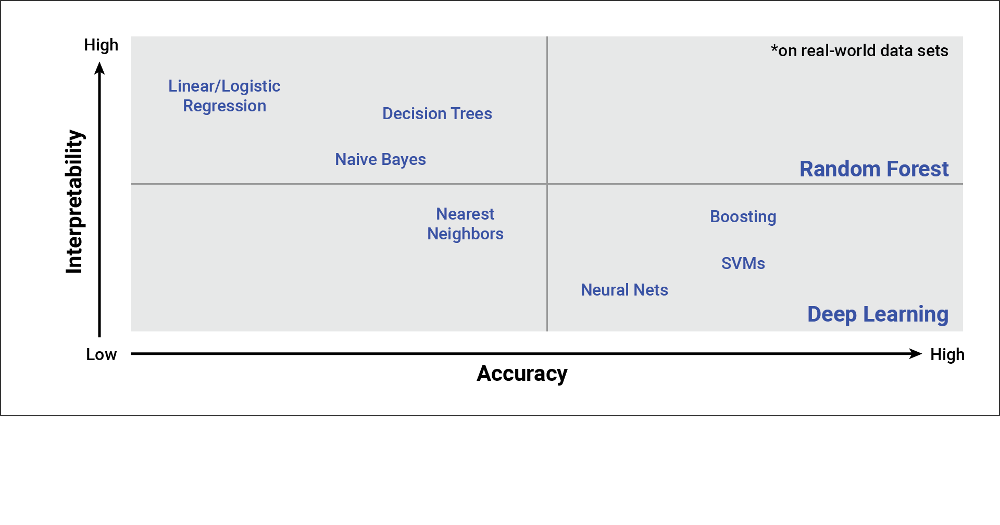

# Module19

The target variable for our model is the "IS_SUCCESSFUL" column.  One non-categorical variable "ASK_AMT" is included in the model and all of the other variables (except for "EIN" and "NAME") are categorical, encoded and included.  "EIN" and "NAME" were dropped.

After encoding the categorical variables in our DataFrame, we have 50 input variables.  In a basic neural network, you want to use two to three times the number of neurons as input variables.

Unlike a basic neural network model, though, we don’t want to use the two to three times multiplier—we don’t want
our deeper layers to overfit the input data.

For our deep learning model, then, we'll use a 1:1 ratio of neurons to input variables - 50 total (33 in the  first layer and 17 in the second).

As far a number of layers in the model, I went with two.  "there is a theoretical finding by Lippmann in the 1987 paper “[An introduction to computing with neural nets](https://ieeexplore.ieee.org/abstract/document/1165576/)” that shows that an MLP with two hidden layers is sufficient" (Jason Brownlee, 2018).

Despite trying a number of tweaks to the model (some examples/attempts included at the bottom of the notebook), I was not quite able to reach the target accuracy of 75%.  My results came in between 72 and 73%.  I tried several things to increase performance ( changing total neuron amounts and amounts between first and second layer, changing the number of items in the two variable buckets - CLASSIFICATION and APPLICATION_TYPE), and changing number or epochs.  I also tried dropping a couple of columns (SPECIAL_CONSIDERATIONS and STATUS) that have only 2 potential values and a very low count in the minority value.  After seeing that dropping these columns had negligible impact, I decided to leave them in.  Finally, I tried different activation function for the hidden layers

If I was to choose a different model to solve this classification problem, I would likely choose the RandomForest as it rivals Deep Learning in terms of accuracy (see chart below extracted from module 19.5.1).  

I ran the numbers using this model (see last cell in the notebook) and while the numbers were close, the Deep Learning model outperformed the RandomForest in accuracy 72.7% to 71.0%.
